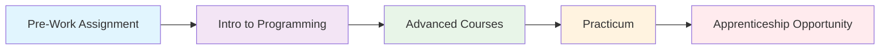

# 🌟 Code the Dream - Intro to Programming Journey

<div align="center">


**A comprehensive collection of coursework, practices, and projects from the Code the Dream Intro to Programming course**

[]()
[]()
[]()
[]()

---

_"Code the Dream envisions a world in which tech innovation comes from all of us and benefits all of us."_

</div>

## 📚 About This Repository

This repository documents my learning journey through **Code the Dream's Intro to Programming course** - a comprehensive 15-week program designed to build strong programming fundamentals. As part of Code the Dream's mission to diversify the tech industry, this course provides free, high-quality coding education to underrepresented communities.

## 🎯 Course Overview

**Code the Dream** is a non-profit organization offering free, remote coding bootcamps focused on creating opportunities for people from backgrounds underrepresented in tech. The Intro to Programming course serves as the foundation for their full-stack development program.

### 📖 Program Details

- **Duration**: 15 weeks (transitioning to 11 weeks in 2026)
- **Format**: Fully online, part-time
- **Time Commitment**: ~20 hours per week
- **Cost**: Completely free
- **Structure**: Flipped classroom model with self-study + live mentor sessions

## 🛠️ Technologies & Skills Covered

<div align="center">

| Core Technologies | Development Tools |     Programming Concepts     |
| :---------------: | :---------------: | :--------------------------: |
|  **JavaScript**   | **Git & GitHub**  | **Programming Fundamentals** |
|     **HTML5**     |    **VS Code**    |     **Problem Solving**      |
|     **CSS3**      | **Command Line**  |        **Debugging**         |
|     **APIs**      | **Web Browsers**  |   **Algorithmic Thinking**   |

</div>

### 🎓 Learning Objectives

- Master JavaScript fundamentals and programming concepts
- Build responsive web pages with HTML5 and CSS3
- Understand version control with Git and GitHub
- Work with APIs and external data sources
- Develop problem-solving and debugging skills
- Prepare for advanced courses (React, Node.js, Ruby on Rails)

## 📁 Repository Structure

```
📦 intro-to-programming/
├── 📂 week-01-JS-Basics-and-Functions/
├── 📂 week-02-JS-Loops-and-Arrays/
├── 📂 week-03-JS-Objects/
├── 📂 week-04-JS-Array-Methods/
├── 📂 week-05-Intro-to-Git/
├── 📂 week-06-A-Deeper-Look-at-Git/
├── 📂 week-07-Understand-the-Web-and-HTML/
├── 📂 week-08-CSS-Basics/
├── 📂 week-09-CSS-Layout/
├── 📂 week-10-Responsive-Design/
├── 📂 week-11-The-DOM-API/
├── 📂 week-12-Asynchronous-Programming-and-Promises/
├── 📂 week-13-Fetch-API/
├── 📂 week-14-Node-NMP-and-Packages/
├── 📂 week-15-final-project/
└──  📂 resources/
```

## 🚀 Key Projects

### 🎨 **Interactive Web Applications**

- **Drawing & Animation Projects**: Khan Academy JavaScript fundamentals
- **DOM Manipulation Exercises**: Dynamic web page interactions
- **API Integration Projects**: Working with real-world data
- **Responsive Design Challenges**: Mobile-first web development

### 💡 **Final Capstone Project**

A comprehensive web application demonstrating all learned concepts, including:

- Clean, semantic HTML structure
- Responsive CSS design
- Interactive JavaScript functionality
- API integration and data handling
- Version control with Git

## 🌱 Learning Path & Progression



**Next Steps**: Upon successful completion, eligible for:

- Advanced React.js course (17 weeks)
- Node.js/Express backend course (17 weeks)
- Ruby on Rails course (17 weeks)
- Paid apprenticeship opportunities at CTD Labs

## 🤝 Code the Dream Community

**Mentorship Model**: Weekly 1:1 sessions with professional software developers
**Peer Learning**: Group coding sessions and collaborative problem-solving
**Industry Connection**: Direct access to working professionals in tech
**Career Support**: Job seeker toolkit and alumni network access

## 📈 Progress Tracking

- [x] **Pre-Work Assignment** - Khan Academy JavaScript Drawing & Animation
- [ ] **Week 1-5**: Programming Fundamentals
- [ ] **Week 6-10**: Intermediate Concepts
- [ ] **Week 11-15**: Advanced Topics & Final Project

## 🎖️ Skills Developed

<div align="center">


</div>

## 🌟 Course Highlights

> _"I had taken JavaScript classes before, but the way it was taught it felt like there was a lot of assumed prior knowledge. This course helped me not only understand how to write my JavaScript code, but also why I could or should write my code in a certain way."_ - CTD Student

**What Makes This Program Special:**

- ✅ **Free tuition** - No upfront costs or income share agreements
- ✅ **Inclusive community** - Focused on underrepresented groups in tech
- ✅ **Professional mentorship** - Learn from working software developers
- ✅ **Real-world preparation** - Curriculum designed for job readiness
- ✅ **Flexible scheduling** - Part-time, remote learning accommodates busy lives
- ✅ **Career pathway** - Clear progression to advanced courses and apprenticeships

## 📞 Connect & Learn More

<div align="center">

[](https://codethedream.org)
[](https://github.com/Code-the-Dream-School)

**Mission**: _Providing a path to life-changing careers in tech for people from backgrounds and communities underrepresented in the industry._

</div>

---

<div align="center">

**📝 Note**: This repository represents my personal learning journey through the Code the Dream program. Each project and exercise demonstrates progressive skill development and practical application of programming concepts.

_Last Updated: July 2025_

</div>
