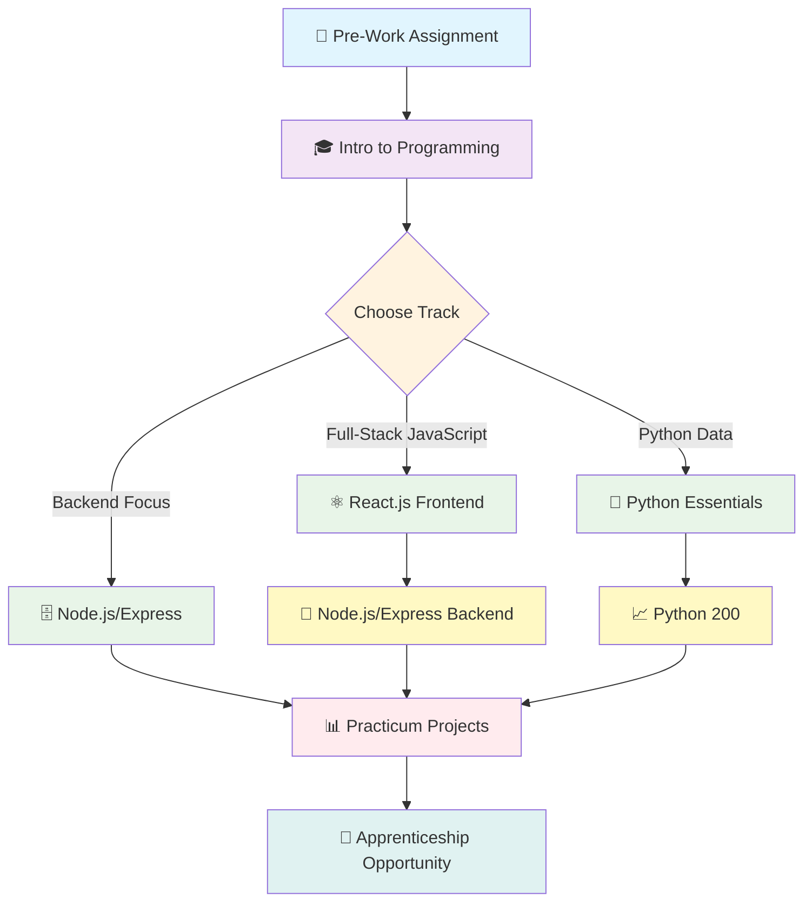

# 🚀 Code the Dream - Complete Learning Journey

<div align="center">


**A comprehensive collection of all coursework, projects, and achievements from the Code the Dream program**

[]()
[]()
[]()
[]()
[]()

---

_"At Code the Dream, we envision a world in which tech innovation comes from all of us and benefits all of us."_

</div>

## 🌟 About This Repository

This repository chronicles my complete educational journey through **Code the Dream** - a transformative, free coding program dedicated to diversifying the tech industry. Each folder represents a milestone in my progression from programming fundamentals to full-stack development and beyond.

## 🎯 About Code the Dream

**Code the Dream** is a non-profit organization providing free, comprehensive coding education to people from backgrounds underrepresented in technology. Their unique model combines rigorous technical training with mentorship, community support, and real-world experience opportunities.

### 🏆 Program Highlights

- **100% Free**: No tuition, no income share agreements
- **Remote & Flexible**: Part-time learning that accommodates life and work
- **Mentorship-Driven**: 1:1 sessions with professional software developers
- **Industry-Connected**: Direct pathways to apprenticeships and careers
- **Community-Focused**: Inclusive environment celebrating diverse backgrounds

## 📚 Learning Pathway Overview

<div align="center">



</div>

## 📁 Repository Structure

```
📦 code-the-dream-journey/
├── 📂 intro-to-programming/          # 15-week foundation course
│   ├── 📂 weekly-lessons/
│   ├── 📂 practice-exercises/
│   ├── 📂 projects/
│   └── 📂 final-portfolio/
├── 📂 react-frontend/                # Advanced React.js course
│   ├── 📂 component-library/
│   ├── 📂 state-management/
│   ├── 📂 routing-navigation/
│   └── 📂 capstone-project/
├── 📂 nodejs-backend/                # Node.js & Express course
│   ├── 📂 server-fundamentals/
│   ├── 📂 database-integration/
│   ├── 📂 api-development/
│   └── 📂 authentication-security/
├── 📂 practicum-projects/            # Real-world client work
│   ├── 📂 team-collaboration/
│   ├── 📂 client-projects/
│   └── 📂 portfolio-development/
├── 📂 apprenticeship/                # CTD Labs experience
│   ├── 📂 professional-projects/
│   ├── 📂 mentorship-notes/
│   └── 📂 career-development/
├── 📂 resources/                     # Learning materials & references
├── 📂 certifications/                # Course completions & achievements
└── 📂 community-contributions/       # CTD community involvement
```

## 🛠️ Technology Stack Progression

### **Foundation Level** 🌱

<div align="center">


</div>

### **Frontend Specialization** ⚛️

<div align="center">


</div>

### **Backend Development** 🗄️

<div align="center">


</div>

### **Data Science Track** 🐍

<div align="center">


</div>

## 📈 Learning Progress

### 🎓 **Completed Courses**

- [x] **Pre-Work Assignment** - Programming foundations
- [ ] **Intro to Programming** (15 weeks) - JavaScript, HTML, CSS fundamentals
- [ ] **Advanced Frontend** (11 weeks) - React.js ecosystem
- [ ] **Backend Development** (11 weeks) - Node.js/Express or Rails
- [ ] **Practicum** - Real-world client projects
- [ ] **Apprenticeship** - Paid professional experience

### 🏅 **Key Achievements**

- [ ] First working web application
- [ ] Advanced project portfolio
- [ ] Team collaboration experience
- [ ] Client project delivery
- [ ] Professional development skills
- [ ] Tech industry employment

## 🌟 Featured Projects

### 💡 **Intro to Programming Portfolio**

_Foundation projects demonstrating core programming concepts_

- Interactive web applications
- DOM manipulation exercises
- API integration projects
- Responsive design implementations

### 🚀 **Advanced Development Projects**

_Full-stack applications showcasing professional-level skills_

- React-based single-page applications
- RESTful API development
- Database design and integration
- Authentication and security implementation

### 🤝 **Practicum & Client Work**

_Real-world projects for actual clients and nonprofits_

- Team-based development workflows
- Agile project management
- Client communication and requirements gathering
- Production deployment and maintenance

## 🤝 Community & Mentorship

**Professional Mentors**: Weekly guidance from experienced software developers
**Peer Learning**: Collaborative problem-solving with fellow students
**Alumni Network**: Connection to successful CTD graduates in tech
**Industry Partnerships**: Direct access to hiring partners and career opportunities

### 💬 Program Impact

> _"Code the Dream has truly redefined what a coding bootcamp can be by blending high-quality tech training with a deeply inclusive, community-focused atmosphere."_ - CTD Alumni

> _"CTD gave me a chance at the job of my dreams. I couldn't finish college in my country and now I have a second chance to learn and be what I want to be."_ - Jose Luis, CTD Graduate

## 🎯 Career Development Goals

**Short-term Objectives:**

- Complete Intro to Programming with strong portfolio
- Advance to specialized track (React/Node.js/Python)
- Build professional network through CTD community

**Long-term Vision:**

- Secure apprenticeship opportunity at CTD Labs
- Transition to full-time software development role
- Give back to CTD community as mentor/volunteer

## 📞 Connect & Resources

<div align="center">

[](https://codethedream.org)
[](https://github.com/Code-the-Dream-School)
[](https://www.linkedin.com/school/code-the-dream/)

**Program Information**: [CTD Learns Overview](https://codethedream.org/classes/)  
**Application Process**: [Getting Started](https://codethedream.org/open-intro-pre-work/)  
**Student Support**: Slack community, mentor sessions, peer groups

</div>

## 🌈 Mission Alignment

Code the Dream's mission resonates deeply with creating a more inclusive tech industry. This repository represents not just personal learning, but participation in a movement to ensure that innovation truly comes from all of us and benefits all of us.

**Diversity Goals**: Supporting underrepresented communities in tech  
**Accessibility Focus**: Free education removing financial barriers  
**Community Impact**: Building technology that serves our communities  
**Career Transformation**: Creating pathways to life-changing opportunities

---

<div align="center">

**📝 Repository Purpose**: This collection documents my transformation from programming beginner to industry-ready developer through Code the Dream's comprehensive, community-driven education model.

_Journey Started: [Date] | Current Phase: [Course/Level] | Next Milestone: [Goal]_

**🚀 "Innovation comes from all of us and benefits all of us"** 🚀

</div>
